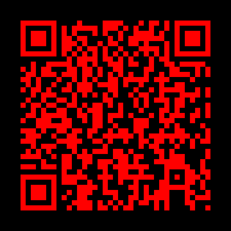
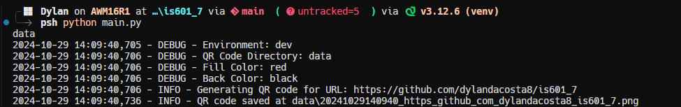

### <h1 align=center>Homework 7</h1>
---
This repository contains the dependencies and code for Homework 7 along with the Dockerfile and dotenv file to run the container

<b>On cloning the repository, please run</b>

```sh
docker build -t qrgen:latest .
```

```sh
docker run -d --name qrgen --env-file .env -v /data:/apps/qr/data qrgen:latest
```
---
<div align=center>

### The Homework meets the following goals:

Generates a QR code that points to the current GitHub repository as seen below:



The logs generated to show the successfull generated and saving of QR code <a href="https://github.com/dylandacosta8/is601_7/blob/main/logs/qr.log"><b>here</b></a>



</div>

---

### Packages Used:

<ol>
<li><b>qrcode:</b> Helps with QR Code generation.</li>
<li><b>pillow:</b> Python Imaging Library is a free and open-source additional library for the Python programming language that adds support for opening, manipulating, and saving many different image file format.</li>
<li><b>python-dotenv: </b>Reads key-value pairs from a .env file and set them as environment variables</li>
</ol>

---